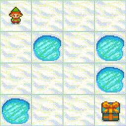

# 🏔️ Deep Q-Network (DQN) for Frozen Lake Environment



## 🎯 Project Overview

Welcome to an exciting implementation of **Deep Q-Network (DQN)** applied to the classic **Frozen Lake** environment! 🧊 This project demonstrates how deep reinforcement learning can solve navigation challenges in a slippery, icy world where one wrong step could lead to disaster! 

### 🌟 What Makes This Special?

- 🧠 **Deep Q-Learning**: Advanced neural network-based Q-learning implementation
- 🎮 **Interactive Environment**: Navigate through a treacherous 4x4 frozen lake
- 📊 **Rich Visualizations**: Beautiful plots and animations of the learning process
- 🎬 **Video Recording**: Watch your agent learn and master the environment
- ⚡ **GPU Optimized**: Designed to run efficiently on Google Colab T4 GPUs
- 📈 **Performance Tracking**: Comprehensive metrics and learning curves

## 🗺️ The Frozen Lake Challenge

The agent must navigate from the starting position (S) to the goal (G) while avoiding holes (H) on a slippery frozen surface:

```
S F F F
F H F H  
F F F H
H F F G
```

- **S**: Starting position 🏁
- **F**: Frozen surface (safe) ❄️
- **H**: Hole (game over) 🕳️
- **G**: Goal (victory!) 🎯

### 🎮 Action Space
- **0**: Left ⬅️
- **1**: Down ⬇️
- **2**: Right ➡️
- **3**: Up ⬆️

## 🚀 Quick Start on Google Colab T4

### 📋 Prerequisites

1. **Google Colab Account**: Sign up at [colab.research.google.com](https://colab.research.google.com)
2. **T4 GPU Access**: Enable GPU runtime for optimal performance

### ⚙️ Setup Instructions

#### Step 1: Enable T4 GPU Runtime
1. Open Google Colab
2. Go to `Runtime` → `Change runtime type`
3. Select `T4 GPU` as Hardware accelerator
4. Click `Save`

#### Step 2: Clone and Setup
```python
# Clone the repository
!git clone https://github.com/raimonvibe/Deep-Q-Network-DQN-Frozen-Lake.git
%cd Deep-Q-Network-DQN-Frozen-Lake

# Install required packages (automatically handled in the notebook)
!pip install gymnasium[toy-text] torch torchvision matplotlib seaborn numpy pandas tqdm imageio imageio-ffmpeg
```

#### Step 3: Run the Notebook
1. Upload the `frozen_lake_dqn_colab-final.ipynb` to your Colab environment
2. Run all cells sequentially
3. Watch your agent learn to navigate the frozen lake! 🎉

### 🔥 Performance on T4 GPU
- **Training Time**: ~5-10 minutes for 2000 episodes
- **Memory Usage**: ~2GB GPU memory
- **Success Rate**: 90%+ after training
- **Convergence**: Typically within 1500 episodes

## 🏗️ Project Architecture

### 📁 File Structure
```
Deep-Q-Network-DQN-Frozen-Lake/
├── 📓 frozen_lake_dqn_colab-final.ipynb  # Main implementation notebook
├── 🎬 lake.gif                           # Environment animation
├── 📄 LICENSE                            # MIT License
└── 📖 README.md                          # This file
```

### 🧠 Core Components

#### 1. **DQN Neural Network** 🤖
```python
class DQN(nn.Module):
    - Input: 16 states (4x4 grid positions)
    - Hidden: 128 neurons with ReLU activation
    - Output: 4 Q-values (one per action)
    - Dropout: 0.2 for regularization
```

#### 2. **Experience Replay Buffer** 💾
```python
class ReplayBuffer:
    - Capacity: 10,000 experiences
    - Sampling: Random batch selection
    - Storage: (state, action, reward, next_state, done) tuples
```

#### 3. **DQN Agent** 🎯
```python
class DQNAgent:
    - Epsilon-greedy exploration
    - Target network for stability
    - Adam optimizer (lr=0.001)
    - Gamma=0.99 for future rewards
```

## 📊 Key Features

### 🎨 Visualizations
- **Environment Rendering**: Real-time grid visualization
- **Learning Curves**: Episode rewards and success rates
- **Q-Value Heatmaps**: Policy visualization
- **Training Progress**: Loss and epsilon decay

### 🎬 Video Recording
- **Agent Demonstrations**: Watch successful episodes
- **Training Progress**: Record learning evolution
- **Success Compilation**: Highlight best performances

### 📈 Performance Metrics
- **Success Rate**: Percentage of episodes reaching the goal
- **Average Reward**: Mean reward per episode
- **Episode Length**: Steps taken to complete episodes
- **Q-Value Evolution**: Learning progress tracking

## 🔧 Hyperparameters

| Parameter | Value | Description |
|-----------|-------|-------------|
| Learning Rate | 0.001 | Adam optimizer learning rate 📚 |
| Gamma | 0.99 | Discount factor for future rewards 🔮 |
| Epsilon Start | 1.0 | Initial exploration rate 🎲 |
| Epsilon Min | 0.01 | Minimum exploration rate 🎯 |
| Epsilon Decay | 0.995 | Exploration decay rate 📉 |
| Batch Size | 32 | Training batch size 📦 |
| Buffer Size | 10,000 | Experience replay capacity 💾 |
| Target Update | 100 | Target network update frequency 🔄 |

## 🎓 Learning Algorithm

### 🔄 Training Loop
1. **Initialize** environment and agent
2. **Observe** current state
3. **Select** action using ε-greedy policy
4. **Execute** action and observe reward
5. **Store** experience in replay buffer
6. **Sample** batch from replay buffer
7. **Update** Q-network using Bellman equation
8. **Update** target network periodically
9. **Decay** exploration rate
10. **Repeat** until convergence

### 📐 Bellman Equation
```
Q(s,a) = r + γ * max(Q(s',a'))
```

Where:
- `Q(s,a)`: Q-value for state-action pair
- `r`: Immediate reward
- `γ`: Discount factor
- `s'`: Next state
- `a'`: Next action

## 📈 Expected Results

After training, you should see:
- 🎯 **Success Rate**: 85-95%
- 📊 **Average Reward**: 0.8-0.9
- ⏱️ **Episode Length**: 6-8 steps (optimal path is 6)
- 🧠 **Convergence**: Around episode 1500

## 🛠️ Troubleshooting

### Common Issues:

#### 🐌 Slow Training
- **Solution**: Ensure T4 GPU is enabled
- **Check**: `torch.cuda.is_available()` returns `True`

#### 📉 Poor Performance
- **Solution**: Increase training episodes
- **Tip**: Adjust epsilon decay rate

#### 💾 Memory Issues
- **Solution**: Reduce batch size or buffer size
- **Alternative**: Use CPU if GPU memory is limited

## 🤝 Contributing

We welcome contributions! 🎉

1. Fork the repository
2. Create a feature branch
3. Make your improvements
4. Add tests if applicable
5. Submit a pull request

## 📜 License

This project is licensed under the MIT License - see the [LICENSE](LICENSE) file for details.

## 🙏 Acknowledgments

- **OpenAI Gymnasium**: For the Frozen Lake environment
- **PyTorch**: For the deep learning framework
- **Google Colab**: For providing free GPU access
- **Reinforcement Learning Community**: For inspiration and knowledge sharing

## 📚 Further Reading

- 📖 [Deep Q-Learning Paper](https://arxiv.org/abs/1312.5602)
- 🎓 [Reinforcement Learning: An Introduction](http://incompleteideas.net/book/the-book.html)
- 🧠 [PyTorch RL Tutorials](https://pytorch.org/tutorials/intermediate/reinforcement_q_learning.html)

---

**Happy Learning!** 🚀 May your agent master the frozen lake and inspire your next RL adventure! ❄️🎯

*Built with ❤️ by [raimonvibe](https://github.com/raimonvibe)*
